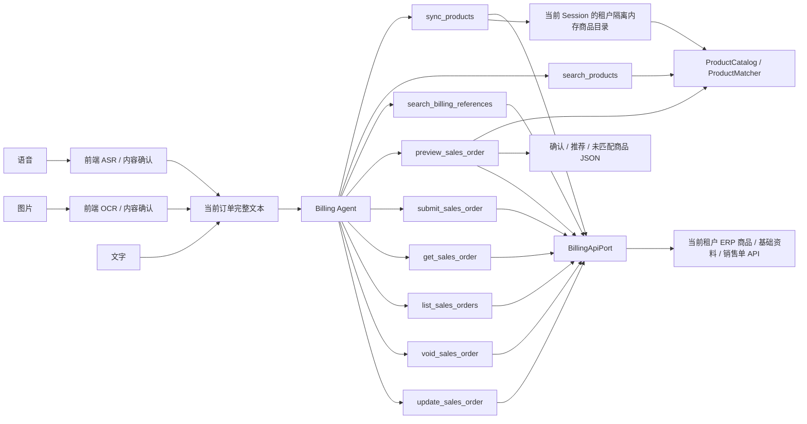

# AI 开单工具、ERP API 与商品匹配

最后更新：2026-08-04

本文描述 ERP 开单服务的最终生产边界。业务方前端负责把文字、语音和图片整理成
当前订单的完整文本；开单 MCP 负责同步真实商品、解析客户/仓库/经手人、校验
必填项、生成销售单预览，并在用户明确确认后写入真实 ERP。工具通过 MCP 返回
结构化 JSON；服务不生成商品目录或草稿 JSON 文件。

## 1. 总体链路



MCP 不接收音频、图片、附件、文件路径或媒体 URL，也不提供 ASR/OCR。即使
`source` 是 `voice` 或 `image`，`preview_sales_order` 接收的仍然是前端整理后的文本。

## 2. 身份与 API 边界

开单服务通过 `/mcp` 发布 Streamable HTTP MCP。每次工具调用携带短期 MCP
Bearer，生产 `McpIdentityResolver` 校验签名、签发者、受众和有效期，再把
`billing:read` / `billing:write` 映射为不含凭据的 `InvocationContext`：

```text
tenant_id
subject_id
account_id
session_id
request_id
scopes
```

ERP 地址由部署环境 `ERP_BILLING_BASE_URL` 固定；只有上游 Bearer 由凭据提供者
根据 `InvocationContext` 注入。URL 和两类 Bearer 均不进入工具参数、模型上下文
或工具结果。

`BillingApiPort` 只保留完整销售单流程所需的固定接口：

```python
fetch_products(context, limit=None) -> BillingProductSnapshot
search_customers(context, keyword, limit=10) -> BillingReferenceSnapshot
search_warehouses(context, keyword, limit=10) -> BillingReferenceSnapshot
search_staff(context, keyword, limit=10) -> BillingReferenceSnapshot
create_sales_order(context, payload) -> BillingSalesOrderResult
get_sales_order_detail(context, order_id) -> BillingSalesOrderDetailResult
search_sales_orders(context, ...) -> BillingSalesOrderPageResult
void_sales_order(context, order_id) -> None
update_sales_order(context, order_id, payload) -> BillingSalesOrderResult
```

Adapter 使用固定相对路径调用云创业版商品目录与销售单接口：

```text
GET  /product/page?pageNum=1&pageSize=20&status=1
GET  /customer/page?pageNum=1&pageSize=10&status=1&keyword=...
GET  /warehouse/page?pageNum=1&pageSize=10&status=1&keyword=...
GET  /staff/page?pageNum=1&pageSize=10&status=1&keyword=...
POST /sales/orders
GET  /sales/orders/{id}
GET  /sales/orders/page?pageNum=1&pageSize=20&sortBy=updateTime&orderType=desc
PUT  /sales/orders/{id}/void
PUT  /sales/orders/{id}
```

接口顶层成功码为 `A00000`，商品数组位于 `data.list`，总数位于 `data.total`。
Adapter 按 20 条一页自动翻页；响应由 `normalize_live_product_rows()` 归一化，
过滤停用和重复商品，只保留当前账号可用的真实商品。字段映射如下：

| 云创业版字段 | 目录字段 |
|---|---|
| `id` | `productId` |
| `code` | `code` |
| `name` | `name` |
| `unit` | `unit` |
| `barcode` | `barcode` |
| `salesPrice` | `price` |
| `stockQuantity` | `stock` |

## 3. 对外工具

开单 Agent 和远程 MCP 发布以下十个工具：

| 工具 | 输入 | 职责 | 主要输出 |
|---|---|---|---|
| `sync_products` | `limit?` | 从当前 ERP 账号同步商品并替换当前 Session 的内存目录 | `catalog_version`、`product_count`、`sample_products` |
| `list_products` | `page?`、`page_size?` | 分页列出当前会话商品目录中的所有商品；目录为空时自动同步 | `page`、`page_size`、`total`、`products` |
| `search_products` | `keyword`、`limit?` | 按 ID、编号、条码、名称、同义词组和模糊相似度查询已有商品 | 唯一商品或顶层 `recommendations` |
| `search_billing_references` | `reference_type`、`keyword?`、`limit?` | 查询客户、出库仓库或经手人候选 | 可用基础资料最小字段 |
| `preview_sales_order` | 完整销售单业务字段、`save_type`、`confirmed_products?`、`partial?` | 校验必填项、解析基础资料、匹配商品并保存不可变预览 | 缺失项、候选、商品数组、`preview_id` |
| `submit_sales_order` | `preview_id`、`idempotency_key`、`confirmed_by_user` | 明确确认后调用真实写单接口 | `order_id`、保存类型、幂等重放标志 |
| `get_sales_order` | `order_id` | 查询销售单详情，含商品明细、收款记录和状态 | `order`（完整 SalesOrderVO） |
| `list_sales_orders` | `page?`、`page_size?`、`sort_by?`、`order_type?`、`start_date?`、`end_date?`、`status?`、`payment_status?`、`return_status?`、`order_no?`、`customer_id?` | 分页查询销售单列表，支持录单日常和客户查询 | `page`、`page_size`、`total`、`orders` |
| `void_sales_order` | `order_id`、`confirmed_by_user` | 用户确认后作废销售单，不可恢复 | `voided`、`order_id` |
| `update_sales_order` | `order_id`、`order_date`、`handler_id`、`items`、`customer_id?`、`warehouse_id?`、`save_type?`、`remark?`、`confirmed_by_user` | 用户确认后修改已存在销售单；建议先查详情 | `modified`、`order_id` |

十个工具的返回值都是 MCP 结构化 JSON 内容。`submit_sales_order`、
`void_sales_order` 和 `update_sales_order` 具有 ERP 写副作用，要求 `billing:write`、
明确用户确认；`submit_sales_order` 额外要求幂等键。`get_sales_order` 和
`list_sales_orders` 是只读操作，要求 `billing:read`。服务不维护可逐行修改的文件草稿，
但会在隔离 Session 中短期保存不可变提交预览和成功幂等结果。

## 4. 商品目录同步

`sync_products` 的处理顺序如下：

1. 从 `InvocationContext` 取得当前租户和账号，并校验 `billing:read`。
2. 通过 `BillingApiPort.fetch_products()` 调用当前 ERP 账号。
3. 归一化并过滤商品目录。
4. 用接口结果替换当前 Session 的租户隔离内存商品目录。
5. 在内存中重建 `ProductCatalog` 和 `ProductMatcher`。
6. 仅返回目录版本和商品数量，不创建商品目录文件，也不返回主机文件路径或业务
   凭据。

示例：

```json
{
  "ok": true,
  "catalog_version": "2026-07-27T10:00:00+00:00",
  "product_count": 1250
}
```

`search_products` 和 `preview_sales_order` 都只使用当前 Session 已加载的内存目录。
`search_products` 在目录为空时返回错误并提示先调用 `sync_products`；
`preview_sales_order` 在目录为空时自动执行一次同步（与 `sync_products` 相同的鉴权和
归一化流程）后再匹配，避免“先报错、再由模型补调 `sync_products`”的额外模型
往返；自动同步失败时直接返回底层错误。Session 释放后，同步得到的商品目录
随之释放，不提供运行时商品目录文件。

## 5. 完整同义词组

别名配置仍使用 `别名 -> 标准名` 形式。默认生鲜别名覆盖薯类、茄果、瓜类、
豆苗、甘蓝类、根茎和猪副等常见区域同义词：

```json
{
  "土豆": "马铃薯", "洋芋": "马铃薯", "洋山芋": "马铃薯", "薯仔": "马铃薯",
  "西红柿": "番茄", "圣女果": "小番茄",
  "胡瓜": "黄瓜", "青瓜": "黄瓜",
  "番瓜": "南瓜", "倭瓜": "南瓜", "金瓜": "南瓜",
  "碗豆尖": "豌豆尖",
  "包菜": "卷心菜", "洋白菜": "卷心菜", "莲花白": "卷心菜", "包心菜": "卷心菜",
  "花菜": "花椰菜", "菜花": "花椰菜",
  "茨菇": "慈菇",
  "肚子": "猪肚"
}
```

默认生鲜别名由 `ERP_BILLING_USE_DEFAULT_FRESH_ALIASES` 控制；外部文件通过
`ERP_BILLING_ALIAS_FILE`（即 `alias_path`）配置。加载时先加入默认别名，再加入
外部文件，因此外部文件中相同的别名键覆盖默认目标；随后才构建同义词组。
`alias_path` 只是启动时读取的配置输入，开单服务不会修改或覆盖该文件。

`ProductCatalog` 将最终别名关系构造成无向、可传递的完整同义词组：

```text
马铃薯同义词组
├── 马铃薯
├── 土豆
├── 洋芋
├── 洋山芋
└── 薯仔
```

因此组内任意名称都可以精确匹配 ERP 中组内任意真实商品名称：

```text
用户“马铃薯” -> ERP“土豆”
用户“洋芋”   -> ERP“土豆”
用户“土豆”   -> ERP“洋芋”
```

匹配只选择 ERP 目录中真实存在的商品。标准名仅用于解释同义关系，不会替换 ERP
商品的 `product_id`、名称、编号或单位。如果组内只命中一个 ERP 商品，可以自动
匹配；如果 ERP 同时存在多个组内商品，则全部进入推荐列表，由用户确认。

上述“组内命中”指 `alias_exact`：ERP 商品名精确等于组内某个名称。当 ERP 商品
采用“别名词 + 修饰词”的复合命名（如“袋装土豆”“土豆毛料”“盒装土豆”）时，商品
名不等于组内任何词，`alias_exact` 无法命中。此时由 `alias_contains` 兜底：用
同义词组里的每个词对商品名做子串探测，命中即进入推荐列表（分数 `0.92`），多个
复合命名候选由用户确认。例如用户输入“山药蛋”，同义词组含“土豆”，即可命中
“袋装土豆”等商品，无需依赖模型改写关键词。

### 5.1 品类词扩展

同义词组描述的是**等同关系**（土豆 = 马铃薯 = 洋芋），组内任意词互相等价。
但在生鲜场景中，还存在**上下位关系**：泛称词（如"牛肉"）是上位词，部位（如
"牛腱子""牛腩"）是下位词。用户说"牛肉 10 斤"时，实际想买的是某个部位的牛肉，
ERP 目录中只有部位级商品（"牛腱子""牛肉-牛腩"），没有单独的"牛肉"商品。

如果把"牛肉 = 牛腱子"塞进同义词组，`alias_exact` 会把两者当等同，在只有一个
"牛腱子"商品时自动命中——但"牛肉"的意图并不等同于"牛腱子"，自动开单会造成
误匹配。因此品类词独立于同义词组，只进推荐不自动命中。

品类词配置使用 `泛称词 -> [部位子串关键词]` 形式。例如：

```json
{
  "牛肉": ["牛腱", "牛腩", "牛里脊", "牛腿", "牛筋", "牛肚", "牛舌", "牛尾", "牛杂", "牛皮", "牛肉"],
  "猪肉": ["排骨", "五花", "猪蹄", "猪肝", "猪肚", "瘦肉", "夹心", "猪肉"],
  "鸡肉": ["鸡腿", "鸡翅", "鸡胸", "鸡爪", "鸡架", "鸡杂", "鸡肉"],
  "羊肉": ["羊腿", "羊排", "羊腩", "羊肉"],
  "鱼": ["草鱼", "鲤鱼", "鳙鱼", "黑鱼", "鳜鱼", "鲅鱼", "鲳鱼", "鱿鱼", "墨鱼", "章鱼"]
}
```

默认品类词由 `ERP_BILLING_USE_DEFAULT_CATEGORIES` 控制；外部文件通过
`ERP_BILLING_CATEGORY_FILE`（即 `category_path`）配置。加载时先加入默认品类词，
再加入外部文件，因此外部文件中相同的键覆盖默认关键词列表。

匹配时，`category_contains`（分数 `0.88`）把泛称词扩展为部位关键词，逐个对商品名
做子串探测。例如用户输入"牛肉"，扩展出 `{"牛腱", "牛腩", ...}`，即可命中"牛腱子"
（含子串"牛腱"）和"牛肉-牛腩"（含子串"牛肉""牛腩"）等商品，全部进入推荐列表
由用户确认。`category_contains` 不在直接匹配类型中，即使只有一个候选也不会自动
开单。

## 6. 确定性匹配与推荐

名称比较先执行 Unicode NFKC、大小写折叠和常见分隔符清理。候选再按以下顺序
处理：

| 匹配类型 | `matchType` | 分数 | 是否自动匹配 |
|---|---|---:|---|
| 商品 ID 精确匹配 | `product_id_exact` | `1.00` | 仅唯一命中时 |
| 商品编号精确匹配 | `code_exact` | `1.00` | 仅唯一命中时 |
| 条码精确匹配 | `barcode_exact` | `1.00` | 仅唯一命中时 |
| 商品全名精确匹配 | `name_exact` | `1.00` | 仅唯一命中时 |
| 商品自带别名精确匹配 | `product_alias_exact` | `1.00` | 仅唯一命中时 |
| 客户货号精确匹配 | `customer_code_exact` | `1.00` | 仅唯一命中时 |
| 完整同义词组精确匹配 | `alias_exact` | `0.98` | 无直接精确命中且唯一时 |
| 完整同义词组包含匹配 | `alias_contains` | `0.92` | 否，只推荐 |
| 品类词包含匹配 | `category_contains` | `0.88` | 否，只推荐 |
| 名称包含匹配 | `contains` | `0.86` | 否，只推荐 |
| 字符串模糊匹配 | `fuzzy` | `0.00–1.00` | 否，只推荐 |

直接精确匹配优先于同义词组。多个直接精确结果、多个同义词结果、名称包含结果和
模糊结果都不能自动开单，只能进入 `recommendations`。模糊候选低于
`ERP_BILLING_RECOMMENDATION_SCORE`（默认 `0.60`）时不会返回。

例如用户查询“洋芋”，ERP 只存“土豆”：

```json
{
  "ok": true,
  "query": "洋芋",
  "canonicalName": "马铃薯",
  "status": "matched",
  "matchType": "alias_exact",
  "product": {
    "product_id": "P001",
    "code": "0001",
    "name": "土豆",
    "unit": "斤",
    "barcode": "",
    "aliases": [],
    "customerCodes": [],
    "price": null,
    "stock": null
  },
  "recommendations": []
}
```

例如用户查询“牛肉”，通过品类词扩展得到多个推荐候选：

```json
{
  "ok": true,
  "query": "牛肉",
  "canonicalName": "牛肉",
  "status": "ambiguous",
  "matchType": null,
  "product": null,
  "recommendations": [
    {
      "rank": 1,
      "score": 0.88,
      "matchType": "category_contains",
      "reason": "品类词包含匹配，仅供推荐",
      "product_id": "P501",
      "code": "000501",
      "name": "牛肉-牛皮",
      "unit": "斤",
      "barcode": "",
      "aliases": [],
      "customerCodes": [],
      "price": null,
      "stock": null
    }
  ]
}
```

## 7. 从完整文本重建草稿

首次开单和每轮修改都调用 `preview_sales_order`。前端或对话层必须先把增量表达整理成
当前订单的完整文本，服务端不依赖上一轮草稿做增量修改。

```text
第一轮：牛肉10斤，土豆5斤
用户修改：牛肉改成20斤，再加3斤西红柿
下一次 order_text：牛肉20斤，土豆5斤，西红柿3斤
```

`preview_sales_order` 内部先解析完整文本为订单行，再做商品匹配。解析规则：

- **分隔符**：换行、逗号（中英文）、分号（中英文），以及"数字+单位"后的空格
  （如 `鸡蛋21个 牛肉10斤` 拆为两行）。数量前置模式（如 `来5斤 洋芋`）中的
  空格不被拆分。
- **"各"模式**：`X和Y各N斤` 和 `XY各N斤` 均支持。后者按 2 字符切分名称
  （`苹果荔枝各5斤` → 苹果 5 斤 + 荔枝 5 斤）。
- **数量前置**：`来十斤马铃薯` / `给我来5斤洋芋` 等口语模式，数量在名称之前。
- **支持单位**：斤、公斤、千克、克、kg、g、ml、l、L、升、毫升、吨、t、瓶、
  件、箱、袋、个、颗、根、把、盒、包、只、份、条、听、提、板、盘、筐、桶、
  卷、打、扎。

调用示例：

```json
{
  "order_text": "牛肉10斤，马铃薯5斤",
  "customer": "客户甲",
  "warehouse": "一号仓",
  "handler": "张三",
  "order_date": "2026-08-04",
  "remark": "下午送达",
  "save_type": "final",
  "source": "voice",
  "confirmed_products": []
}
```

成功响应的商品匹配部分只保留开单商品字段，并按结果分成三个顶层数组；此外还
返回必填缺失项、基础资料解析、单位警告、提交就绪状态和可选预览：

- `confirmed_products`：唯一精准匹配或用户已确认的商品。
- `recommended_products`：存在候选但尚未确认的商品；匹配度最高者在外层，其余
  候选放入 `similar_products`。
- `unmatched_products`：完全没有候选的订单商品。

```json
{
  "confirmed_products": [
    {
      "product_id": "P001",
      "product_name": "土豆",
      "unit": "斤",
      "quantity": 5
    }
  ],
  "recommended_products": [
    {
      "product_id": "P501",
      "product_name": "牛肉-牛皮",
      "unit": "斤",
      "quantity": 10,
      "similar_products": [
        {
          "product_id": "P502",
          "product_name": "牛肉-牛蹄",
          "unit": "斤",
          "quantity": 10
        }
      ]
    }
  ],
  "unmatched_products": [
    {
      "product_id": null,
      "product_name": "未知商品",
      "unit": "箱",
      "quantity": 2
    }
  ]
}
```

商品对象只允许 `product_id`、`product_name`、`unit`、`quantity` 四个商品字段。
不再返回 `ok`、草稿元数据、原始文本、匹配状态、分数、原因、编号、条码、价格或
库存。没有候选的订单行不会被丢弃：它会进入 `unmatched_products`，`product_id`
为 `null`，`product_name`、`unit` 和 `quantity` 使用用户输入。

## 8. 前端确认推荐商品

用户改选推荐商品后，调用方根据完整订单文本中的订单行编号生成 `line_id`，把稳定
的 `product_id` 连同当前完整订单文本再次提交给 `preview_sales_order`。`confirmed_products`
格式为 JSON 数组，每个元素包含 `line_id` 和 `product_id`：

```json
{
  "order_text": "牛肉10斤，马铃薯5斤",
  "customer": "客户甲",
  "warehouse": "一号仓",
  "handler": "张三",
  "order_date": "2026-08-04",
  "source": "text",
  "confirmed_products": [
    {"line_id": "L001", "product_id": "P502"}
  ]
}
```

`confirmed_products` 也接受 `dict[str, str]` 格式（向后兼容）和 JSON 字符串（容错）。
对 `unmatched_products` 中无候选的行，同样可通过 `confirmed_products` 手动指定 ERP 商品 ID。

当部分商品无法匹配且用户同意只提交已匹配商品时，可传 `partial=true` 生成只含
已匹配商品的部分预览；未匹配行被跳过，不出现在预览中。

服务端会从文本重新解析和匹配，然后逐项校验：

1. `line_id` 必须存在于本次完整文本生成的订单行。
2. `product_id` 必须存在于当前租户商品目录。
3. 该商品必须属于该行本次重新计算出的精确结果或推荐候选；但 `unmatched_products`
   中无候选的行允许从全目录手动指定商品。

校验通过后，用户选择的商品进入 `confirmed_products`，不再出现在
`recommended_products`。前端修改商品名称、删除或重排订单行后，必须根据最新的
完整订单文本重新生成行号；失效或跨行的旧确认不会被静默接受。

这一步只生成不可变预览，不代表已写入 ERP，也不会生成 JSON 文件。前端或 Agent
展示当前预览并取得明确确认后，调用 `submit_sales_order` 完成真实提交。

## 9. 安全与隔离

- 商品目录、ToolSet 和运行时按 `(tenant_id, account_id, session_id)` 隔离。
- ERP API 同步的商品只保存在当前 Session 内存中，不生成商品目录文件。
- `ERP_BILLING_PRODUCT_CATALOG`、`alias_path` 和 `category_path` 如有配置，仅作为服务端只读输入；
  模型和前端不能提供主机文件路径。
- Adapter 只调用源码中固定的相对路径。
- 商品只能来自当前目录；模型不能编造 `product_id`、编号、条码、单位或价格。
- `confirmed_products` 必须重新通过当前目录和当前匹配结果校验。
- Bearer、Cookie 和业务 Token 不写入日志、商品目录或工具结果。
- 开单服务独立部署，并使用专属域名、认证配置和 Session 存储。
