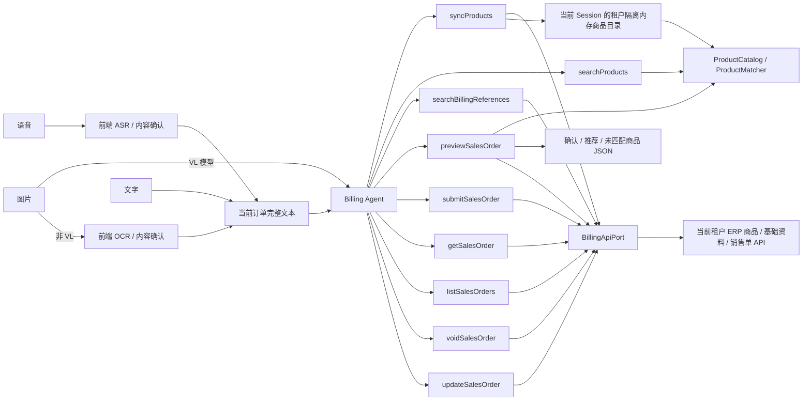

# AI 业务工具、ERP API 与商品匹配

最后更新：2026-09-20

本文描述 ERP 业务 MCP 服务的最终生产边界。业务方前端负责把文字、语音和图片整理成
当前订单的完整文本；MCP 负责同步真实商品、解析客户/仓库/经手人、校验必填项、
生成单据预览，并在用户明确确认后写入真实 ERP。工具通过 MCP 返回结构化 JSON；
服务不生成商品目录或草稿 JSON 文件。

服务共发布 59 个工具，覆盖销售、采购、退货、库存与资金报表五个业务域（完整清单见
`AGENTS.md`「业务场景覆盖」）。所有写操作复用同一套「预览 → 确认 → 提交」两段式
契约；本文以销售单链路为主线展开，采购单、退货单、库存单据和收付款单的
`previewXxx` / `submitXxx` 遵循相同模式，仅业务字段不同。

## 1. 总体链路



MCP 不接收音频、图片、附件、文件路径或媒体 URL，也不提供 ASR/OCR。使用
多模态模型（VL）时，Agent 按 `ERP_BILLING_SYSTEM_PROMPT` 第十二章规则直接
读图并组装 `order_text`，`source` 传 `image`；非 VL 模型仍由前端 OCR
转文本后传入。无论哪种方式，`previewSalesOrder` 接收的都是文本。

## 2. 身份与 API 边界

开单服务通过 `/mcp` 发布 Streamable HTTP MCP。生产环境的每次工具调用直接携带
ERP JWT / OAuth2 Bearer；可信 AI 平台负责前置鉴权，`McpIdentityResolver` 校验
Token 结构和身份字段，再把 `billing:read` / `billing:write` 映射为不含凭据的
`InvocationContext`。原 Token 随后交给 ERP API 做最终鉴权：

```text
tenant_id
subject_id
account_id
session_id
request_id
scopes
```

ERP 地址由部署环境 `ERP_BILLING_BASE_URL` 固定；同一 ERP Bearer 由凭据提供者
根据 `InvocationContext` 注入当前请求。URL 和 Bearer 均不进入工具参数、模型
上下文或工具结果。

`BillingApiPort` 按业务域保留固定接口，全部以 `InvocationContext` 为第一参数：

```python
# 商品目录与基础资料
fetch_products(context, limit=None) -> BillingProductSnapshot
search_customers / search_warehouses / search_staff
search_suppliers / search_settlement_accounts

# 销售单与销售退货
create_sales_order(context, payload) -> BillingSalesOrderResult
get_sales_order_detail(context, order_id) -> BillingSalesOrderDetailResult
search_sales_orders(context, ...) -> BillingSalesOrderPageResult
void_sales_order(context, order_id) -> None
update_sales_order(context, order_id, payload) -> BillingSalesOrderResult
receive_sales_order(context, payload)                    # 销售单继续收款
get_sales_order_quick_return(context, order_id)          # 退货快捷预填
create_sales_return / get_sales_return_detail
search_sales_returns / void_sales_return

# 采购单与采购退货
create_purchase_order / get_purchase_order_detail / search_purchase_orders
void_purchase_order / update_purchase_order
pay_purchase_order(context, payload)                     # 采购单继续付款
get_purchase_order_quick_return / create_purchase_return
get_purchase_return_detail / search_purchase_returns / void_purchase_return

# 库存
query_stock_page / get_stock_by_product / get_stock_summary
query_stock_logs / list_stock_alerts / get_purchase_suggestions
list_stock_doc_types(context, doc_direction)
create_stock_transfer / get_stock_transfer_detail
create_other_stock_doc / get_other_stock_doc_detail

# 资金与报表
create_receipt_order / create_payment_order
get_financial_order_detail(context, kind, order_id) / list_financial_orders
void_financial_order(context, kind, order_id) -> None
list_receivables / list_payables / get_financial_status
query_sales_report / query_purchase_report / query_profit_report
query_settlement_report / query_reconciliation
```

Adapter 使用固定相对路径调用云创业版接口，按业务域分组：

```text
# 商品目录与基础资料
GET  /product/page?pageNum=1&pageSize=100&status=1
GET  /customer/page、/warehouse/page、/staff/page
GET  /supplier/page、/settlement-account/page

# 销售单与销售退货
POST /sales/orders          GET  /sales/orders/{id}
GET  /sales/orders/page     PUT  /sales/orders/{id}
PUT  /sales/orders/{id}/void
POST /sales/orders/receipt                       # 销售单继续收款
GET  /sales/orders/{id}/quick-return             # 退货快捷预填
POST /sales/returns          GET  /sales/returns/{id}
GET  /sales/returns/page     PUT  /sales/returns/{id}/void

# 采购单与采购退货
POST /purchase/orders        GET  /purchase/orders/{id}
GET  /purchase/orders/page   PUT  /purchase/orders/{id}
PUT  /purchase/orders/{id}/void
POST /purchase/orders/payment                    # 采购单继续付款
GET  /purchase/orders/{id}/quick-return          # 退货快捷预填
POST /purchase/returns       GET  /purchase/returns/{id}
GET  /purchase/returns/page  PUT  /purchase/returns/{id}/void

# 库存
GET  /inventory/page、/inventory/detail-by-product、/inventory/summary
GET  /inventory/logs/page、/inventory/alerts/list、/inventory/alerts/purchase-suggestions
GET  /inventory/inbound-type/list、/inventory/outbound-type/list
POST /inventory/transfers    GET  /inventory/transfers/{id}
POST /inventory/other-inbounds、/inventory/other-outbounds

# 资金与报表
POST /financial/receipt-orders、/financial/payment-orders
GET  /financial/receipt-orders/page、/financial/payment-orders/page
GET  /financial/receivables/{...}、/financial/payables/{...}、/financial/status
GET  /sales/analysis、/sales/details/page、/sales/details/summary
GET  /sales/ranking/product、/sales/ranking/customer
GET  /purchase/statistics、/purchase/details/page、/purchase/details/summary
GET  /financial/profits/summary、/financial/profits/by-customer、/financial/profits/by-product
GET  /financial/settlements/statistics
GET  /financial/reconciliation/summary/page、/financial/reconciliation/statement/page
```

接口顶层成功码为 `A00000`，商品数组位于 `data.list`，总数位于 `data.total`。
Adapter 按 100 条一页自动翻页（减少串行往返，保护首单耗时）；目录为空时
的自动同步受 `ERP_BILLING_AUTO_SYNC_LIMIT`（缺省 10000）限制，避免超大
商品目录把首次开单拖到超时。响应由 `normalize_live_product_rows()` 归一化，
过滤停用和重复商品，只保留当前账号可用的真实商品。字段映射如下：

| 云创业版字段 | 目录字段 | 说明 |
|---|---|---|
| `id` | `productId` | 商品 ID |
| `code` | `code` | 商品编号 |
| `name` | `name` | 商品名称 |
| `unit` | `unit` | 单位/基础单位 |
| `barcode` | `barcode` | 条码 |
| `specification` | `specification` | 规格型号 |
| `salesPrice` | `price` | 销售价 |
| `purchasePrice` | `purchasePrice` | 采购价 |
| `stockQuantity` | `stock` | 当前库存 |
| `status` | `status` | 状态（1=启用） |

`listProducts` 和 `syncProducts` 的 `sample_products` 返回 `listing_fields()`，
包含 `product_id`、`product_name`、`unit`、`code`、`specification`、
`purchase_price`、`sales_price`、`stock_quantity` 和 `status`。开单预览
（`previewSalesOrder`）只返回提交核对所需的名称、数量、单位、销售单价和
可确定的金额，不返回采购价、库存等目录扩展字段。

## 3. 对外工具

开单服务通过远程 MCP 共发布 59 个工具：商品目录与基础资料 4 个、销售单 6 个、
采购单 6 个、采购退货 5 个、销售退货 5 个、单据收付款 4 个、库存单据 4 个、
收付款单 10 个、库存与往来查询 10 个、报表分析 5 个。完整清单与输入 Schema 以
`AGENTS.md`「业务场景覆盖」和 MCP `tools/list` 为准。销售单链路的工具如下：

| 工具 | 输入 | 职责 | 主要输出 |
|---|---|---|---|
| `syncProducts` | `limit?` | 从当前 ERP 账号同步商品并替换当前 Session 的内存目录 | `catalog_version`、`product_count`、`sample_products` |
| `listProducts` | `page?`、`page_size?` | 分页列出当前会话商品目录中的所有商品；目录为空时自动同步 | `page`、`page_size`、`total`、`has_more`、`products` |
| `searchProducts` | `keywords`、`limit?` | 按 ID、编号、条码、名称、同义词组和模糊相似度批量查询已有商品 | 每个关键词的匹配状态、唯一商品或 `recommendations` |
| `searchBillingReferences` | `reference_type`、`keyword?`、`limit?`、`page?` | 查询客户、供应商、仓库、经手人或结算账户候选，支持翻页 | 分页元数据、名称、默认标记 |
| `previewSalesOrder` | 完整销售单业务字段、`save_type`、`confirmed_products?`、`partial?` | 校验必填项、解析基础资料、匹配商品并保存不可变预览 | 有序待办、缺失项、候选、商品数组、预览金额、`preview_id` |
| `submitSalesOrder` | `preview_id`、可选 `idempotency_key`、`confirmed_by_user` | 明确确认后调用真实写单接口 | `order_no`（业务单号）、保存类型、幂等重放标志 |
| `getSalesOrder` | `order_id` | 查询销售单详情，含商品明细、收款记录和状态 | `order`（完整 SalesOrderVO） |
| `listSalesOrders` | `page?`、`page_size?`、`sort_by?`、`order_type?`、`start_date?`、`end_date?`、`status?`、`payment_status?`、`return_status?`、`order_no?`、`customer_id?` | 分页查询销售单列表，支持录单日期和客户查询 | `page`、`page_size`、`total`、`has_more`、`orders` |
| `voidSalesOrder` | `order_id`、`confirmed_by_user` | 用户确认后作废销售单，不可恢复 | `voided`、`order_no`（业务单号） |
| `updateSalesOrder` | `order_id`、`order_date?`、`handler_id?`、`items?`、`customer_id?`、`warehouse_id?`、`save_type?`、`remark?`、`confirmed_by_user` | 用户确认后修改已存在销售单；建议先查详情；经手人、客户、仓库可传内部 ID 或名称（纯数字视为内部 ID，名称须唯一匹配） | `modified`、`order_no`（业务单号） |

采购单、退货单、库存单据与收付款单的工具命名遵循同一模式：`previewXxx`
生成不可变预览，`submitXxx` 凭 `preview_id` 与 `confirmed_by_user` 真实写入，
`getXxx` / `listXxx` 只读查询，`voidXxx` 确认后作废；提交签名统一为
`(preview_id, idempotency_key?, confirmed_by_user)`。除销售单提供
`save_type`（draft=0 / pre_receipt=1 / final=2）外，其余写操作固定
`saveType=2` 正式生效。

所有工具的返回值都是 MCP 结构化 JSON 内容。全部 `submitXxx`、`voidXxx` 和
`updateXxx` 具有 ERP 写副作用，要求 `billing:write`、
明确用户确认；`submitXxx` 可省略幂等键（默认绑定 preview_id），预览提交成功后即失效，
不可用新幂等键重复提交。`getXxx` 和
`listXxx` 是只读操作，要求 `billing:read`。服务不维护可逐行修改的文件草稿，
但会在隔离 Session 中短期保存不可变提交预览和成功幂等结果。

`listProducts`、`searchBillingReferences` 和 `listSalesOrders` 统一返回
`page`、`page_size`、`total` 与 `has_more`。基础资料候选已由 MCP 按精确命中、
默认项、名称相关度排序，返回 id、code、name、is_default；ID 用于机器调用，不向终端用户展示；
默认项仅供推荐，仍须用户确认。

## 4. 商品目录同步

`syncProducts` 的处理顺序如下：

1. 从 `InvocationContext` 取得当前租户和账号，并校验 `billing:read`。
2. 通过 `BillingApiPort.fetch_products()` 调用当前 ERP 账号。
3. 归一化并过滤商品目录。
4. 用接口结果刷新租户级共享的内存商品目录；显式 `limit` 截断同步只作用于
   当前会话，不影响同租户其他会话。
5. 在内存中重建 `ProductCatalog` 和 `ProductMatcher`。
6. 仅返回目录版本和商品数量，不创建商品目录文件，也不返回主机文件路径或业务
   凭据。

示例：

```json
{
  "ok": true,
  "catalog_version": "2026-07-27T10:00:00+00:00",
  "product_count": 1250
}
```

`searchProducts` 和 `previewSalesOrder` 都只使用已加载的内存目录。
`searchProducts` 在目录为空时返回错误并提示先调用 `syncProducts`；
`previewSalesOrder` 在目录为空时自动执行一次同步（与 `syncProducts` 相同的鉴权和
归一化流程）后再匹配，避免“先报错、再由模型补调 `syncProducts`”的额外模型
往返；自动同步失败时直接返回底层错误。目录随租户缓存常驻内存、按 TTL 后台
刷新，不提供运行时商品目录文件。

## 5. 完整同义词组

别名配置仍使用 `别名 -> 标准名` 形式。默认生鲜别名覆盖薯类、茄果、瓜类、
豆苗、甘蓝类、根茎和猪副等常见区域同义词：

```json
{
  "土豆": "马铃薯", "洋芋": "马铃薯", "洋山芋": "马铃薯", "薯仔": "马铃薯",
  "西红柿": "番茄", "圣女果": "小番茄",
  "胡瓜": "黄瓜", "青瓜": "黄瓜",
  "番瓜": "南瓜", "倭瓜": "南瓜", "金瓜": "南瓜",
  "碗豆尖": "豌豆尖",
  "包菜": "卷心菜", "洋白菜": "卷心菜", "莲花白": "卷心菜", "包心菜": "卷心菜",
  "花菜": "花椰菜", "菜花": "花椰菜",
  "茨菇": "慈菇",
  "肚子": "猪肚"
}
```

默认生鲜别名由 `ERP_BILLING_USE_DEFAULT_FRESH_ALIASES` 控制；外部文件通过
`ERP_BILLING_ALIAS_FILE`（即 `alias_path`）配置。加载时先加入默认别名，再加入
外部文件，因此外部文件中相同的别名键覆盖默认目标；随后才构建同义词组。
`alias_path` 只是启动时读取的配置输入，开单服务不会修改或覆盖该文件。

`ProductCatalog` 将最终别名关系构造成无向、可传递的完整同义词组：

```text
马铃薯同义词组
├── 马铃薯
├── 土豆
├── 洋芋
├── 洋山芋
└── 薯仔
```

因此组内任意名称都可以精确匹配 ERP 中组内任意真实商品名称：

```text
用户“马铃薯” -> ERP“土豆”
用户“洋芋”   -> ERP“土豆”
用户“土豆”   -> ERP“洋芋”
```

匹配只选择 ERP 目录中真实存在的商品。标准名仅用于解释同义关系，不会替换 ERP
商品的 `product_id`、名称、编号或单位。如果组内只命中一个 ERP 商品，可以自动
匹配；如果 ERP 同时存在多个组内商品，则全部进入推荐列表，由用户确认。

上述“组内命中”指 `alias_exact`：ERP 商品名精确等于组内某个名称。当 ERP 商品
采用“别名词 + 修饰词”的复合命名（如“袋装土豆”“土豆毛料”“盒装土豆”）时，商品
名不等于组内任何词，`alias_exact` 无法命中。此时由 `alias_contains` 兜底：用
同义词组里的每个词对商品名做子串探测，命中即进入推荐列表（分数 `0.92`），多个
复合命名候选由用户确认。例如用户输入“山药蛋”，同义词组含“土豆”，即可命中
“袋装土豆”等商品，无需依赖模型改写关键词。

### 5.1 品类词扩展

同义词组描述的是**等同关系**（土豆 = 马铃薯 = 洋芋），组内任意词互相等价。
但在生鲜场景中，还存在**上下位关系**：泛称词（如"牛肉"）是上位词，部位（如
"牛腱子""牛腩"）是下位词。用户说"牛肉 10 斤"时，实际想买的是某个部位的牛肉，
ERP 目录中只有部位级商品（"牛腱子""牛肉-牛腩"），没有单独的"牛肉"商品。

如果把"牛肉 = 牛腱子"塞进同义词组，`alias_exact` 会把两者当等同，在只有一个
"牛腱子"商品时自动命中——但"牛肉"的意图并不等同于"牛腱子"，自动开单会造成
误匹配。因此品类词独立于同义词组，只进推荐不自动命中。

品类词配置使用 `泛称词 -> [部位子串关键词]` 形式。例如：

```json
{
  "牛肉": ["牛腱", "牛腩", "牛里脊", "牛腿", "牛筋", "牛肚", "牛舌", "牛尾", "牛杂", "牛皮", "牛肉"],
  "猪肉": ["排骨", "五花", "猪蹄", "猪肝", "猪肚", "瘦肉", "夹心", "猪肉"],
  "鸡肉": ["鸡腿", "鸡翅", "鸡胸", "鸡爪", "鸡架", "鸡杂", "鸡肉"],
  "羊肉": ["羊腿", "羊排", "羊腩", "羊肉"],
  "鱼": ["草鱼", "鲤鱼", "鳙鱼", "黑鱼", "鳜鱼", "鲅鱼", "鲳鱼", "鱿鱼", "墨鱼", "章鱼"]
}
```

默认品类词由 `ERP_BILLING_USE_DEFAULT_CATEGORIES` 控制；外部文件通过
`ERP_BILLING_CATEGORY_FILE`（即 `category_path`）配置。加载时先加入默认品类词，
再加入外部文件，因此外部文件中相同的键覆盖默认关键词列表。

匹配时，`category_contains`（分数 `0.88`）把泛称词扩展为部位关键词，逐个对商品名
做子串探测。例如用户输入"牛肉"，扩展出 `{"牛腱", "牛腩", ...}`，即可命中"牛腱子"
（含子串"牛腱"）和"牛肉-牛腩"（含子串"牛肉""牛腩"）等商品，全部进入推荐列表
由用户确认。`category_contains` 不在直接匹配类型中，即使只有一个候选也不会自动
开单。

## 6. 确定性匹配与推荐

名称比较先执行 Unicode NFKC、大小写折叠和常见分隔符清理。候选再按以下顺序
处理：

| 匹配类型 | `matchType` | 分数 | 是否自动匹配 |
|---|---|---:|---|
| 商品 ID 精确匹配 | `product_id_exact` | `1.00` | 仅唯一命中时 |
| 商品编号精确匹配 | `code_exact` | `1.00` | 仅唯一命中时 |
| 条码精确匹配 | `barcode_exact` | `1.00` | 仅唯一命中时 |
| 商品全名精确匹配 | `name_exact` | `1.00` | 仅唯一命中时 |
| 商品自带别名精确匹配 | `product_alias_exact` | `1.00` | 仅唯一命中时 |
| 客户货号精确匹配 | `customer_code_exact` | `1.00` | 仅唯一命中时 |
| 完整同义词组精确匹配 | `alias_exact` | `0.98` | 无直接精确命中且唯一时 |
| 完整同义词组包含匹配 | `alias_contains` | `0.92` | 否，只推荐 |
| 品类词包含匹配 | `category_contains` | `0.88` | 否，只推荐 |
| 名称包含匹配 | `contains` | `0.86` | 否，只推荐 |
| 字符串模糊匹配 | `fuzzy` | `0.00–1.00` | 否，只推荐 |

直接精确匹配优先于同义词组。多个直接精确结果、多个同义词结果、名称包含结果和
模糊结果都不能自动开单，只能进入 `recommendations`。模糊候选低于
`ERP_BILLING_RECOMMENDATION_SCORE`（默认 `0.60`）时不会返回。

例如用户查询“洋芋”，ERP 只存“土豆”：

```json
{
  "ok": true,
  "query": "洋芋",
  "canonicalName": "马铃薯",
  "status": "matched",
  "matchType": "alias_exact",
  "product": {
    "product_id": "P001",
    "code": "0001",
    "name": "土豆",
    "unit": "斤",
    "barcode": "",
    "aliases": [],
    "customerCodes": [],
    "price": null,
    "stock": null
  },
  "recommendations": []
}
```

例如用户查询“牛肉”，通过品类词扩展得到多个推荐候选：

```json
{
  "ok": true,
  "query": "牛肉",
  "canonicalName": "牛肉",
  "status": "ambiguous",
  "matchType": null,
  "product": null,
  "recommendations": [
    {
      "rank": 1,
      "score": 0.88,
      "matchType": "category_contains",
      "reason": "品类词包含匹配，仅供推荐",
      "product_id": "P501",
      "code": "000501",
      "name": "牛肉-牛皮",
      "unit": "斤",
      "barcode": "",
      "aliases": [],
      "customerCodes": [],
      "price": null,
      "stock": null
    }
  ]
}
```

## 7. 从完整文本重建草稿

首次开单和每轮修改都调用 `previewSalesOrder`。前端或对话层必须先把增量表达整理成
当前订单的完整文本，服务端不依赖上一轮草稿做增量修改。

```text
第一轮：牛肉10斤，土豆5斤
用户修改：牛肉改成20斤，再加3斤西红柿
下一次 order_text：牛肉20斤，土豆5斤，西红柿3斤
```

`previewSalesOrder` 内部先解析完整文本为订单行，再做商品匹配。解析规则：

- **分隔符**：换行、逗号（中英文）、分号（中英文），以及"数字+单位"后的空格
  （如 `鸡蛋21个 牛肉10斤` 拆为两行）。数量前置模式（如 `来5斤 洋芋`）中的
  空格不被拆分。
- **"各"模式**：`X和Y各N斤` 和 `XY各N斤` 均支持。后者按 2 字符切分名称
  （`苹果和荔枝各5斤` → 苹果 5 斤 + 荔枝 5 斤）；连续无分隔名称不做双字切分。
- **数量前置**：`来十斤马铃薯` / `给我来5斤洋芋` 等口语模式，数量在名称之前。
- **支持单位**：斤、公斤、千克、克、kg、g、ml、l、L、升、毫升、吨、t、瓶、
  件、箱、袋、个、颗、根、把、盒、包、只、份、条、听、提、板、盘、筐、桶、
  卷、打、扎。

调用示例：

```json
{
  "order_text": "牛肉10斤，马铃薯5斤",
  "customer": "客户甲",
  "warehouse": "一号仓",
  "handler": "张三",
  "order_date": "2026-08-04",
  "remark": "下午送达",
  "save_type": "final",
  "source": "voice",
  "confirmed_products": []
}
```

成功响应的商品匹配部分只保留开单商品字段，并按结果分成三个顶层数组；此外还
返回必填缺失项、基础资料解析、单位警告、提交就绪状态和可选预览：

- `confirmed_products`：唯一精准匹配或用户已确认的商品。
- `recommended_products`：存在候选但尚未确认的商品；匹配度最高者在外层，其余
  候选放入 `similar_products`。
- `unmatched_products`：完全没有候选的订单商品。

```json
{
  "confirmed_products": [
    {
      "product_id": "P001",
      "product_name": "土豆",
      "unit": "斤",
      "quantity": 5
    }
  ],
  "recommended_products": [
    {
      "product_id": "P501",
      "product_name": "牛肉-牛皮",
      "unit": "斤",
      "quantity": 10,
      "similar_products": [
        {
          "product_id": "P502",
          "product_name": "牛肉-牛蹄",
          "unit": "斤",
          "quantity": 10
        }
      ]
    }
  ],
  "unmatched_products": [
    {
      "product_id": null,
      "product_name": "未知商品",
      "unit": "箱",
      "quantity": 2
    }
  ]
}
```

商品对象只允许 `product_id`、`product_name`、`unit`、`quantity` 四个商品字段。
不再返回 `ok`、草稿元数据、原始文本、匹配状态、分数、原因、编号、条码、价格或
库存。没有候选的订单行不会被丢弃：它会进入 `unmatched_products`，`product_id`
为 `null`，`product_name`、`unit` 和 `quantity` 使用用户输入。

## 8. 前端确认推荐商品

用户改选推荐商品后，调用方根据完整订单文本中的订单行编号生成 `line_id`，把稳定
的 `product_id` 连同当前完整订单文本再次提交给 `previewSalesOrder`。`confirmed_products`
格式为 JSON 数组，每个元素包含 `line_id` 和 `product_id`：

```json
{
  "order_text": "牛肉10斤，马铃薯5斤",
  "customer": "客户甲",
  "warehouse": "一号仓",
  "handler": "张三",
  "order_date": "2026-08-04",
  "source": "text",
  "confirmed_products": [
    {"line_id": "L001", "product_id": "P502"}
  ]
}
```

`confirmed_products` 只接受 Schema 声明的数组格式，每项必须包含 `line_id` 和
`product_id`。对 `unmatched_products` 中无候选的行，同样可通过该数组手动指定
ERP 商品 ID。

当部分商品无法匹配且用户同意只提交已匹配商品时，可传 `partial=true` 生成只含
已匹配商品的部分预览；未匹配行被跳过，不出现在预览中。

服务端会从文本重新解析和匹配，然后逐项校验：

1. `line_id` 必须存在于本次完整文本生成的订单行。
2. `product_id` 必须存在于当前租户商品目录。
3. 该商品必须属于该行本次重新计算出的精确结果或推荐候选；但 `unmatched_products`
   中无候选的行允许从全目录手动指定商品。

校验通过后，用户选择的商品进入 `confirmed_products`，不再出现在
`recommended_products`。前端修改商品名称、删除或重排订单行后，必须根据最新的
完整订单文本重新生成行号；失效或跨行的旧确认不会被静默接受。

这一步只生成不可变预览，不代表已写入 ERP，也不会生成 JSON 文件。前端或 Agent
展示当前预览并取得明确确认后，调用 `submitSalesOrder` 完成真实提交。

## 9. 安全与隔离

- ToolSet 和运行时按 `(tenant_id, account_id, session_id)` 隔离。
- 商品目录是租户级共享的内存缓存（TTL 与过期后台刷新），会话淘汰后不回退
  冷启动；ERP API 同步的商品不落盘，不生成商品目录文件。
- `ERP_BILLING_PRODUCT_CATALOG`、`alias_path` 和 `category_path` 如有配置，仅作为服务端只读输入；
  模型和前端不能提供主机文件路径。
- Adapter 只调用源码中固定的相对路径。
- 商品只能来自当前目录；模型不能编造 `product_id`、编号、条码、单位或价格。
- `confirmed_products` 必须重新通过当前目录和当前匹配结果校验。
- Bearer、Cookie 和业务 Token 不写入日志、商品目录或工具结果。
- 开单服务独立部署，并使用专属域名、认证配置和 Session 存储。


## 单位确认、局部修改与错误诊断（2026-09-11）

已核对 [ERP OpenAPI](https://test-ai.yuncyb.com/aicyberp-api/v3/api-docs)
中的销售单 PUT、作废 PUT，以及 SalesOrderUpdateDTO / SalesOrderItemDTO /
SalesOrderVO / SalesOrderItemVO。

### 单位确认

单位不一致时仍不生成可提交预览，避免未确认换算进入写单。
响应的 unit_warnings 提供 line_id、product_id、requested_quantity、
requested_unit 和 erp_unit。用户确认 ERP 单位下的数量后，保留原 order_text，
再次调用 previewSalesOrder 并传：

```json
{"confirmed_units": [{"line_id": "L001", "product_id": "P001", "unit": "斤", "quantity": 4}]}
```

确认必须绑定当前行的已匹配商品，单位必须等于当前 ERP 单位；重复行、错行、
错商品、非有限或过小数量均拒绝。无需让模型重写自然语言单位或猜测换算。
生成新预览后，仍须向用户展示并取得提交确认。

### 局部修改

updateSalesOrder 只要求 order_id；confirmed_by_user=true 才执行写入。
省略日期、经手人、备注或明细表示保留 ERP 当前值，remark="" 明确清空。
传 items 表示完整替换明细，不是按行合并。

ToolSet 校验显式修改字段；Adapter 读取最新详情并按 ERP 完整 PUT 契约合并。
保留明细 id 到 orderItemId 的映射，以及 unitId、conversionRate、单价、行备注。
已收金额不映射为 receiptAmount，避免把历史收款当成追加收款。
只有显式传 receipt_amount 才追加；省略 save_type 保持现状。
修改仅支持 draft=0、final=2，pre_receipt=1 仅用于新增单据。

已作废单据拒绝修改；已生效单据客户、仓库、优惠金额和优惠账户不可变。
显式编辑已生效明细必须提供 order_item_id。数量、价格等其余业务限制由 ERP
最终判定，不能宣称无条件可改。

ERP 当前无版本号、If-Match 或原子局部更新接口。读取最新值能减少旧数据回填，
但不能消除 GET 与 PUT 之间其他客户端写入造成的覆盖。要彻底解决，需要 ERP
支持原子条件更新；不以本进程锁或二次查询冒充跨客户端并发保护。

### 提交与错误

submitSalesOrder 的 idempotency_key 可省略，默认绑定 preview_id。
显式 key 的重放与冲突规则不变，提交结果未知仍禁止盲目重试。
幂等结果目前属于会话内存；ERP 创建接口不接收该 key，进程重启后无法提供持久
业务幂等。跨重启保证需要 ERP 唯一业务键或持久提交协议，不在 MCP 内伪造保证。

业务错误保留稳定的 MCP code、ERP message，并在 error.details 中提供
upstream_code、trace_id；HTTP 失败另含 http_status。不返回整个响应 data。
401 表示需要重新授权，403 表示无操作权限；写入 5xx 仍视为结果未知。
上游只提供笼统原因时，不推断成已收款、已发货或其他未经证实的原因。

商品目录继续采用租户共享 TTL 与过期后台刷新，属于最终一致缓存，并非实时价格
承诺。刷新期间可能读取旧值；要求最新目录时先显式 syncProducts。


## 身份选择与确定性解析（2026-09-11）

- 基础资料只按相同 ID 去重，名称相同、前缀相同或业务后缀不同均不代表同一实体。
  搜索和预览候选保留 id/code/name/is_default。同会话返回过的资料 ID 按资料类型
  隔离保存（最多 200 条），可直接回传选择，避免把 ID 当关键词再次搜索。
  缓存仅用于定位已选身份，不替代 ERP 对状态、权限和最终写入的校验。
- 支持“销售 1 本书本”“我要买一本书”和明确的名称、数量、单位文本。
  解析失败不默认数量 1；负数、非有限数及不能明确解释的中文数量拒绝。
  “各”必须明确写出“和”连接的商品，取消按两个字切分名称的猜测逻辑。
  不能确定时要求用户提供分行的“商品名+数量+单位”，不把猜测结果送去开单。
- 商品搜索与列表、预览统一通过 ensure_catalog 加载目录，使用已有租户 TTL 刷新。
  syncProducts 的 limit 只接受正整数或 null；字符串、布尔值、零及负数在访问 ERP 前拒绝。
- 空销售单标识在详情查询入口拒绝，不再把空路径交给 ERP。
