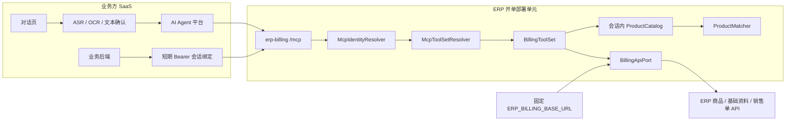
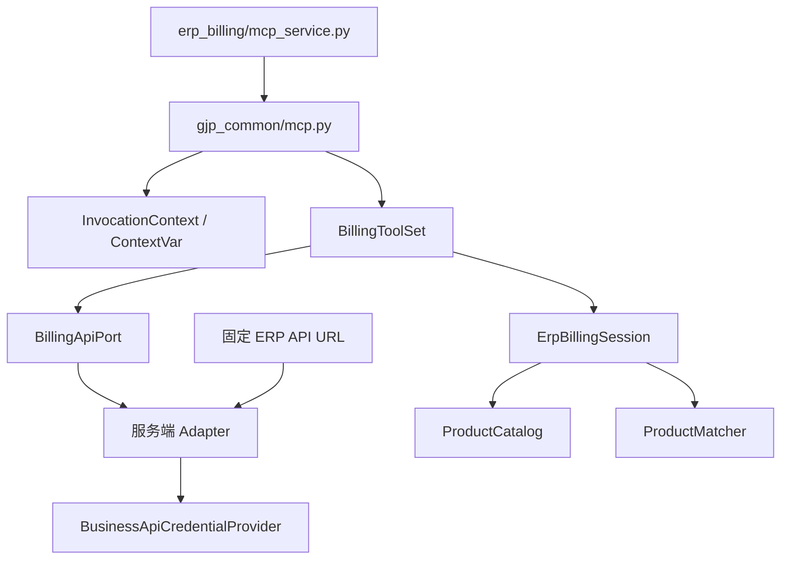
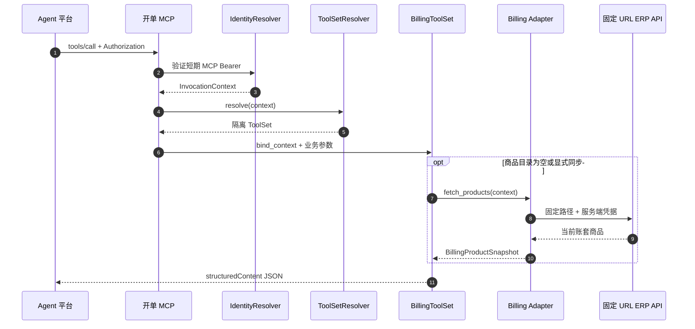
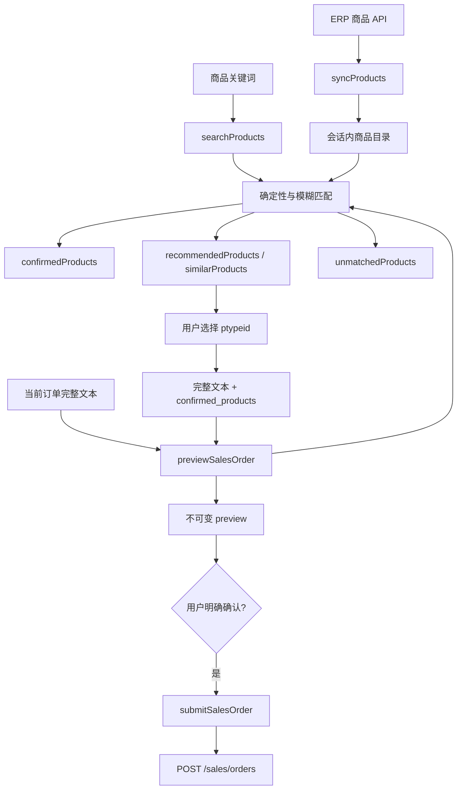

# GJP ERP AI 开单架构图

最后更新：2026-08-04

## 1. 系统边界

业务方先把语音和图片转换为用户确认后的当前订单完整文本。生产 MCP 不提供媒体
上传、ASR、OCR 或附件工具。

## 2. 代码分层

| 层 | 职责 |
|---|---|
| `erp_billing.mcp_service` | 创建只发布 `BillingToolSet` 的 MCP 应用 |
| `gjp_common.mcp` | 复用 AgentScope Tool Schema，按调用绑定身份和 ToolSet |
| `gjp_common.context` | 保存无凭据的租户、账号、会话和 scopes |
| `gjp_common.connections` | 校验固定 ERP 地址，并按会话解析 Bearer |
| `erp_billing` | 资料查询、商品匹配、销售单预览和写入 |

## 3. MCP 单次调用

固定 Base URL、Bearer 和 Cookie 不进入 `InvocationContext`、工具参数、工具结果
或模型上下文。

## 4. 开单链路

工具还包含 `search_sales_order_options` 与 `submitSalesOrder`。服务不生成草稿文件；
只有确认提交工具在满足 `billing:write`、当前预览和幂等键后写入 ERP。

## 5. 隔离规则

- ToolSet 和商品目录按 `(tenant_id, account_id, session_id)` 隔离。
- MCP Bearer 只标识当前会话；ERP Bearer 只存在于服务端凭据存储。
- ERP API URL 是部署级固定配置，不按会话解析。
- Adapter 只接收源码中固定的相对路径，拒绝模型提供完整 URL。
- 工具 Schema 不含身份、地址、鉴权、音频、图片、附件或文件路径字段。
- `confirmed_products` 必须引用当前租户目录中的真实商品。
