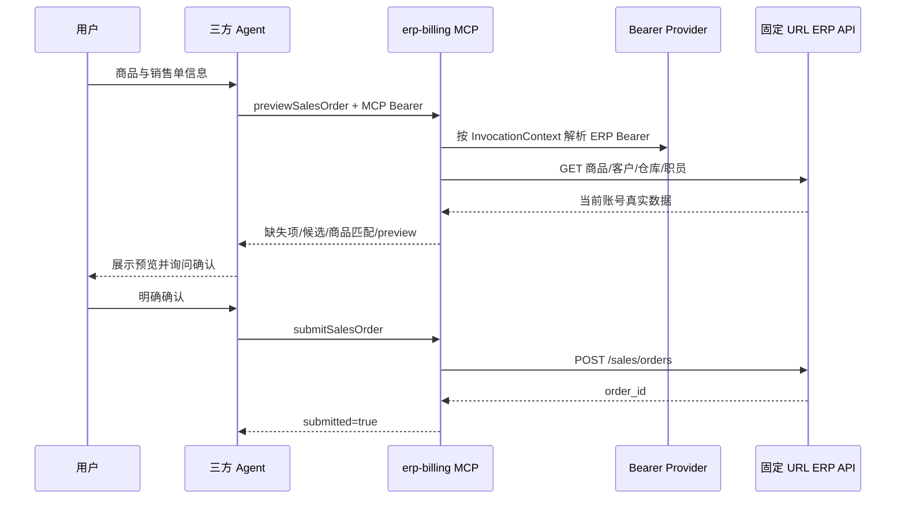

# 销售开单 MCP 与 AI 平台对接

## 服务信息

| 项目 | 值 |
|---|---|
| MCP Server | `erp-billing` |
| Streamable HTTP | `POST /mcp` |
| SSE | `GET /sse` |
| 工具数 | 5 |
| 读取权限 | `billing:read` |
| 写单权限 | `billing:write` |

生产环境使用 HTTPS。AI 平台在 MCP Header 中传短期 MCP Bearer：

```text
Authorization: Bearer <MCP Bearer>
```

ERP API URL 是部署级固定值 `ERP_BILLING_BASE_URL`，不随租户、请求或 Tool 调用
变化。会话存储只需要按 `InvocationContext` 解析当前上游 Bearer。



## 工具契约

| 工具 | 说明 |
|---|---|
| `syncProducts` | 主动刷新隔离会话商品目录 |
| `searchProducts` | 独立查商品；模糊结果只推荐 |
| `searchBillingReferences` | `reference_type` 为 customer/warehouse/handler |
| `previewSalesOrder` | 校验完整销售单并生成不可变预览 |
| `submitSalesOrder` | 明确确认后真实写单 |

业务必填项：客户、出库仓库、经手人、录单日期和商品明细。备注可选。接口技术字段
`id=0`、`save_type=0/1/2` 由工具内部生成。

准备调用示例：

```json
{
  "order_text": "牛肉2斤，土豆5斤",
  "customer": "客户甲",
  "warehouse": "一号仓",
  "handler": "张三",
  "order_date": "2026-08-04",
  "remark": "下午送达",
  "save_type": "final",
  "source": "text",
  "confirmed_products": []
}
```

Agent 根据返回值处理：

- `missing_required_fields`：继续追问必填项。
- `needs_confirmation`：展示客户/仓库/经手人候选，不自行选择。
- `recommended_products`：展示商品候选，确认后重调完整准备请求。
- `unmatched_products`：请用户修改名称或检查 ERP 商品。
- `unit_warnings`：请用户按 ERP 单位重新确认数量，不猜测换算。
- `ready_to_submit=true`：展示 `preview` 并询问是否确认提交。

提交调用示例：

```json
{
  "preview_id": "sales-preview-...",
  "idempotency_key": "tenant-1-conversation-42-v1",
  "confirmed_by_user": true
}
```

只有用户看到当前预览后明确确认，才可传 `confirmed_by_user=true`。任何内容修改都
必须重新准备并使用新的 `preview_id`。

## AgentScope 2.0.5 客户端

```python
from agentscope.mcp import HttpMCPConfig, MCPClient
from agentscope.tool import Toolkit

client = MCPClient(
    name="erp-billing",
    is_stateful=False,
    mcp_config=HttpMCPConfig(
        url="https://<billing-host>/mcp",
        headers={"Authorization": "Bearer " + mcp_bearer},
    ),
)
toolkit = Toolkit(mcps=[client])
```

## 生产凭据提供者

```python
from gjp_common.connections import BusinessApiCredential

class BillingCredentialProvider:
    def resolve(self, context):
        record = session_repository.require(
            tenant_id=context.tenant_id,
            account_id=context.account_id,
            session_id=context.session_id,
        )
        return BusinessApiCredential(
            kind="bearer",
            value=secret_manager.decrypt(record.encrypted_bearer),
        )
```

URL 不在会话记录中。HTTP 客户端在启动时绑定固定地址：

```python
http = BusinessAuthenticatedJsonClient(
    base_url=settings.erp_billing_base_url,
    credential_provider=BillingCredentialProvider(),
)
```

## 安全检查

- Tool Schema 不出现 URL、账号、密码、验证码、JWT、Cookie 或 Token。
- 固定 ERP URL 为 HTTPS，且不含 query、fragment 或用户信息。
- MCP Bearer 即 ERP JWT，服务端从 payload 解析身份。
- `billing:write`、用户确认、当前预览和幂等键缺一不可。
- 多副本把预览与幂等结果迁移到共享存储。
