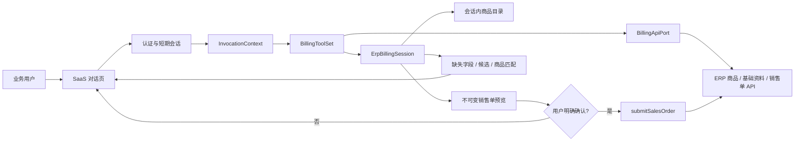

# ERP AI 开单业务数据与数据流

最后更新：2026-08-04

## 1. 数据边界



| 数据 | 模型可见 | Tool Schema 可见 | 存放位置 |
|---|---:|---:|---|
| 当前订单完整文本 | 是 | 是 | Agent / `previewSalesOrder` 参数 |
| 客户、仓库、经手人、录单日期、备注 | 是 | 是 | `previewSalesOrder` 参数 |
| `preview_id` / `idempotency_key` / 确认标志 | 是 | 是 | `submitSalesOrder` 参数 |
| `tenant_id` / `account_id` / `session_id` | 否 | 否 | `InvocationContext` |
| MCP JWT / OAuth2 | 否 | 否 | 网关或认证层 |
| 云创业版上游 Bearer | 否 | 否 | 服务端连接存储 |
| ERP Base URL | 否 | 否 | 部署级固定配置 `ERP_BILLING_BASE_URL` |
| 原始语音、附件 | 否 | 否 | 业务方前端 |
| 原始图片 | VL 模型可见 | 否 | Agent 上下文（VL 模型直接读图，不进入 MCP） |
| 商品目录 | 否 | 否 | 当前 `ErpBillingSession` 内存 |

## 2. 核心对象

| 对象 | 职责 | 生命周期 |
|---|---|---|
| `InvocationContext` | 当前租户、主体、账套、会话、请求和 scopes | 单次请求绑定 |
| `BusinessApiCredential` | 当前会话云创业版 Bearer | 服务端短期会话 |
| 固定 API URL | 所有会话共用的 ERP API 根地址 | 进程启动到停止 |
| `BillingProductSnapshot` | Adapter 返回的规范化商品集合 | 单次同步 |
| `BillingReferenceSnapshot` | 客户、仓库、职员候选集合 | 单次查询 |
| `ProductCatalog` | 当前会话真实商品、编号、条码和别名索引 | ToolSet/Session 生命周期 |
| `OrderLine` | 从完整文本解析的商品、数量、单位和稳定行号 | 单次开单计算 |
| `DraftLine` | 匹配状态、选中商品与候选商品 | 单次开单计算 |
| `BillingDraft` | 确认、推荐和未匹配商品的结构化结果 | 单次响应 |
| 销售单预览 | 已解析基础资料 ID、商品和真实 API Payload | 当前隔离 Session，最多 20 份 |
| 幂等结果 | 成功写单结果，防止同一 Agent 重试重复开单 | 当前隔离 Session，最多 50 份 |

## 3. 商品同步

1. MCP 认证层生成 `InvocationContext`。
2. `McpToolSetResolver` 返回当前会话的 `BillingToolSet`。
3. `syncProducts` 校验 `billing:read`。
4. `BillingApiPort.fetch_products(context)` 获取当前账套商品。
5. Adapter 只调用源码中固定的 ERP 相对路径。
6. `ErpBillingSession.replace_products()` 原子替换当前会话的内存目录。

`previewSalesOrder` 发现商品目录为空时也会自动同步一次。商品目录不写入仓库文件或
共享进程级缓存。

## 4. 查询、预览与提交

`searchProducts` 对每个关键词返回：

- `matched`：唯一精确命中；
- `ambiguous`：存在多个精确、包含或模糊候选；
- `unmatched`：没有候选。

销售单业务必填项为客户、出库仓库、经手人、录单日期和商品明细；备注可选且最多
200 字。`id=0` 与 `save_type` 是接口必填但由工具内部管理，不由客户填写。

`previewSalesOrder` 每次从当前订单完整文本重新计算并解析基础资料：

```json
{
  "order_text": "牛肉10斤，马铃薯5斤",
  "customer": "客户甲",
  "warehouse": "一号仓",
  "handler": "张三",
  "order_date": "2026-08-04",
  "remark": "下午送达",
  "source": "text",
  "confirmed_products": [
    {"line_id": "L001", "product_id": "P-BEEF-1"}
  ]
}
```

输出同时包含 `missing_required_fields`、`reference_resolutions`、
`needs_confirmation`、`unit_warnings`、三个商品匹配数组以及 `ready_to_submit`。
基础资料和商品全部唯一确定且单位一致时，工具保存不可变 API Payload，并返回
`preview_id` 与可展示的 `preview`。

`submitSalesOrder(preview_id, idempotency_key, confirmed_by_user)` 校验
`billing:write`。只有 `confirmed_by_user=true` 才调用 `POST /sales/orders`；成功后
同一会话复用幂等结果。`save_type` 映射为草稿 `0`、预收 `1`、正式 `2`。

## 5. 安全与隔离

- 生产不提供账号密码登录入口。
- 凭据不进入日志、工具参数、模型消息、结构化结果或领域 Session。
- Session、商品目录和 ToolSet 按租户、账套、会话隔离。
- 业务 API 地址固定配置，必须为 HTTPS，且不能包含用户信息、query 或 fragment。
- 上游返回 401/403 时要求业务后端重新授权，不允许 Agent 索要凭据。
- 写单必须同时满足 `billing:write`、当前预览、用户明确确认和幂等键。
- 当前幂等记录是会话内防重；生产多副本部署应将幂等键落到共享存储或由 ERP
  网关提供强幂等保证。
