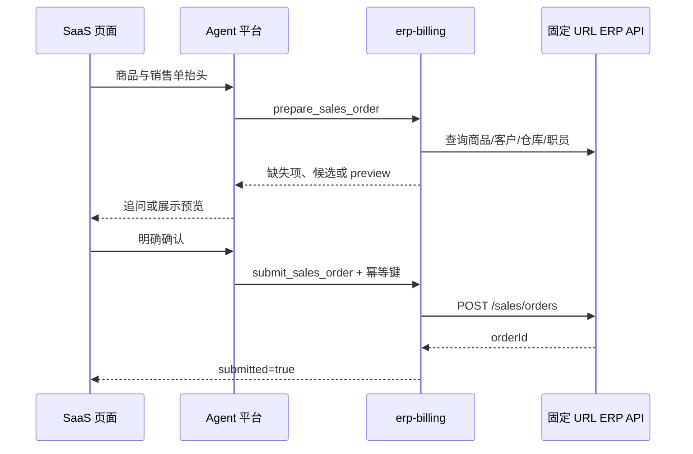

# SaaS 对话页与销售开单 MCP 集成

## 责任边界

| 组件 | 负责 |
|---|---|
| SaaS 对话页 | 文本输入、ASR/OCR、识别确认、预览展示、最终确认 |
| SaaS 后端 | 用户认证、账套绑定、短期 MCP Bearer、ERP Bearer 加密与撤销 |
| Agent 平台 | 必填追问、工具调用和候选确认 |
| 开单 MCP | 资料解析、商品匹配、预览与确认后的销售单写入 |

ERP API URL 由 MCP 部署环境固定配置，不属于 SaaS 会话数据。

## 会话数据

```text
MCP bearer hash
  -> tenant_id / subject_id / account_id / session_id
  -> scopes = [billing:read, billing:write]
  -> encrypted upstream Bearer
  -> credential_expires_at / session_expires_at
```

URL 不在该记录中。返回给 Agent 平台的 MCP Bearer 不携带 ERP Bearer。

## 调用时序



任何修改都必须用完整销售单信息重新调用 `prepare_sales_order`。`submit_sales_order`
必须具有 `billing:write`，并传当前 `preview_id`、明确确认标志和幂等键。
