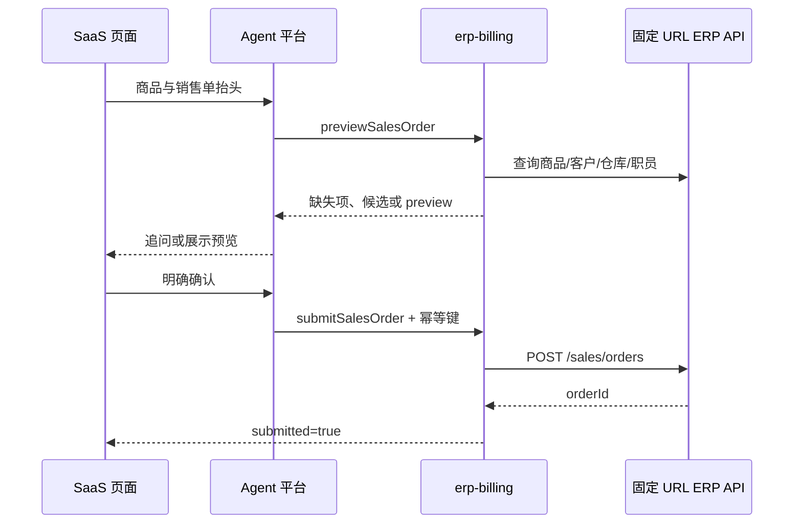

# SaaS 对话页与销售开单 MCP 集成

## 责任边界

| 组件 | 负责 |
|---|---|
| SaaS 对话页 | 文本输入、ASR、图片上传、预览展示、最终确认（VL 模型可直接传图给 Agent，非 VL 仍需前端 OCR） |
| SaaS 后端 | 用户认证、账套绑定、ERP JWT / OAuth2 Bearer 的签发与撤销 |
| Agent 平台 | 必填追问、工具调用和候选确认 |
| 开单 MCP | 资料解析、商品匹配、预览与确认后的销售单写入 |

ERP API URL 由 MCP 部署环境固定配置，不属于 SaaS 会话数据。

## 会话数据

```text
ERP bearer payload
  -> tenant_id / subject_id / account_id
X-Conversation-Id
  -> session_id
  -> scopes = [billing:read, billing:write]
  -> credential_expires_at
```

URL 不在该记录中。Agent 平台直接把 ERP JWT / OAuth2 Bearer 放入 MCP
`Authorization` Header；服务端只在请求上下文对应的凭据存储中暂存原 Bearer，
模型可见参数不包含任何凭据。

## 调用时序



任何修改都必须用完整销售单信息重新调用 `previewSalesOrder`。`submitSalesOrder`
必须具有 `billing:write`，并传当前 `preview_id`、明确确认标志和幂等键。
